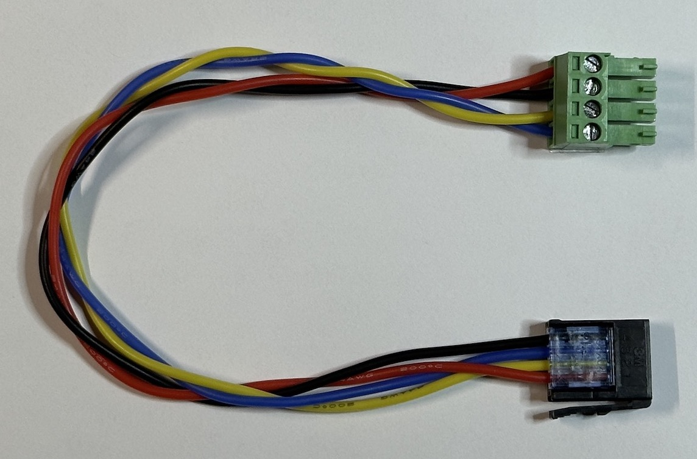
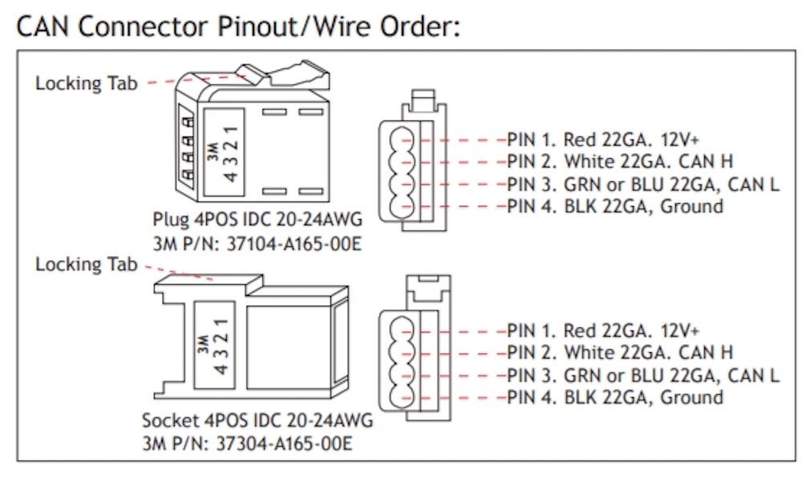

# RV-Bridge: HomeKit to RV-C Bridge

## Features

* Connects to RV-C network in many recent model RVs
    * (RV-C is a subset of CAN-Bus running at 250kbps)
* Uses ESP32 with a CAN-Bus interface
* Connects lights, fans, and thermostats to HomeKit
* Plugs into unused CAN-Bus connectors inside control panel.

## Current Project State

* Homespan pairing works, devices show up in Home app.
* CAN-Bus receiving works.
* CAN-Bus messages route correctly to HomeKit devices
* Correct RV-C messages are being sent

## To-Do:

* Verify thermostat functions
* RV device state changes are recognized by the packet inspector but not reflected in the HomeKit device states.
*   - Added code to make all HK characteristic changes within the service's loop function to hopefully fix that.

## Hardware

Uses an ESP32 with a CAN-Bus interface, either separate components, or more easily:

CopperHillTech Website:

[ESP32 WiFi, Bluetooth Classic, BLE, CAN Bus Module](https://copperhilltech.com/esp32-wifi-bluetooth-classic-ble-can-bus-module/)

## Wiring

Connector is a 3M 37104-A165-00E MB and can be sourced from [Digikey](https://www.digikey.com/en/products/detail/3m/37104-A165-00E%2520MB/1855697)

Insert 24AWG wires into connector and compress to make connections. Twist the data and power pairs together and screw into the terminal block from the CAN-Bus interface.

## Firmware Setup

- Project is set up for compilation with PlatformIO
- config.h
    * Rename config-sample.h to config.h
    * Enter Wifi SSID and password for the RV network.
    * Include a definition file for the RV devices (see Miramar.h for an example)
        * Each light will have an output number and a name, and a flag specifying if it can be dimmed.
        * Each fan has three output numbers, one for the fan power, and one each for the up and down output.
        * Each thermostat has a number, and output numbers for the A/C compressor, low fan, high fan, and furnace outputs.
        * Output numbers can be determined from the "G7 Panel Outputs" screen of the Network Diagnostics of your Multiplex Control Panel (or equivalent).
- Flashing
    * Note: If using an ESP32 with a USB-C connector and flashing from a Mac, you may need to connect it via a USB hub due to some timing weirdness around resetting the ESP32 into boot mode.
- Startup
    * Connect to the ESP32 via Serial Monitor.
    * You should see all of the startup logging.
    * Then a message about being connected to Wifi.
- Pairing
    * In the Home app choose "Add Accessory".
    * Point the camera at this image:
        - 
    * Accept that this is an "unsupported" device.
    * Add the bridge and all of your accessories, choosing appropriate rooms for them.
    * Done!

## 3D Printing

- STL Files in the docs folder:
    * ***RV-Bridge_Box_Bottom.stl***
    * ***RV-Bridge_Box_Top.stl***
- Slicer
    * Prusa Slicer 2.5.0
- Filament
    * PETG (handles heat better than PLA)
- Settings
    * Layer height 0.3mm
    * Set extrusion width to 0.55 (eliminates tiny infill strips in walls)
    * Perimeter transitioning threshold angle to 20 (keeps the lettering connected)

## Notes

- If the bridge seems to become unresponsive at some point, verify that the controlling device is on the RV's Wifi and not some other Wifi.

## References

To-Do
